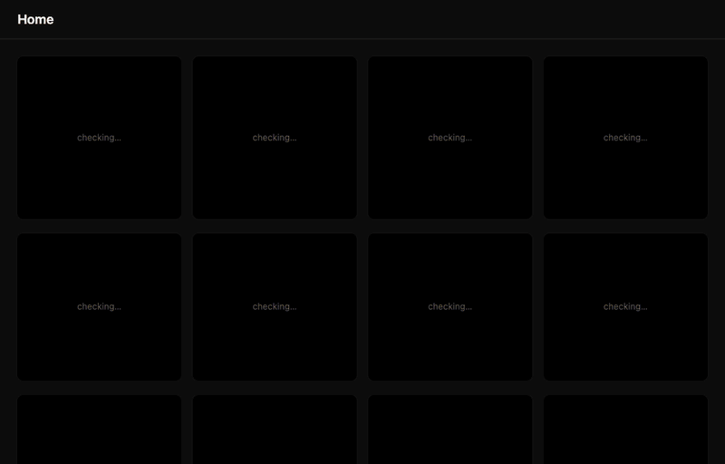
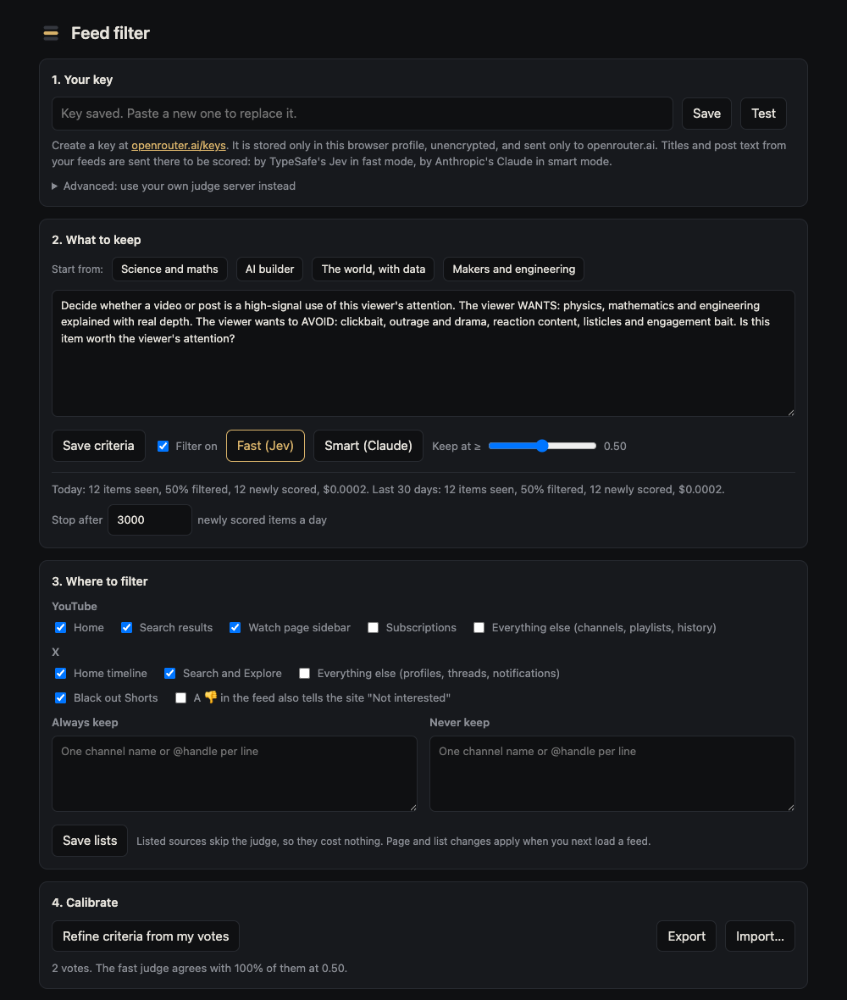

# Feed filter

Blacks out YouTube and X feed items that don't match criteria you write in plain English,
so the feed you see is closer to what you came for.



A fast classifier ([TypeSafe's Jev](https://openrouter.ai/typesafe), via OpenRouter) scores
each title or post in about a third of a second for roughly $0.02 per thousand items. Your
👍/👎 votes tune it: a larger model rewrites your criteria from the votes, the rewrite is
tested against them, and you decide whether to apply it.

There are two parts. Most people only need the first.

## 1. The extension (`extension/`)

Standalone. Works in Chrome, Brave and other Chromium browsers with your own OpenRouter key.

1. Get a key at https://openrouter.ai/keys and add a little credit.
2. Open `chrome://extensions`, turn on **Developer mode**, click **Load unpacked**, choose the `extension/` folder.
3. The settings page opens. Paste the key, **Save**, **Test**.
4. Pick a starting profile or describe what you want under "What to keep", and save.
5. Open YouTube or X.

What you get:

- **Veils, not removal.** Failing tiles go black with their score; click one to peek. Shorts and ad slots are hidden.
- **Votes that teach.** 👍/👎 on any tile or in the settings page. "Refine criteria from my votes" rewrites your criteria and shows how well the rewrite matches before you apply it. A 👎 on a tile can also tell the site "Not interested".
- **Always-keep and never-keep lists** for channels and accounts. Listed sources skip the judge and cost nothing.
- **Per-page switches.** Home feeds, search and the watch sidebar are filtered by default; subscriptions, channels, history, profiles and threads are left alone unless you switch them on.
- **Usage and cost** for today and the last 30 days, with a daily cap on newly scored items.
- **Clear failures.** If the key is missing, out of credit or rate-limited, the feed is left unfiltered and a notice says why.
- **Export and import** of criteria, settings and votes as one file. The key is never in it.

Details are in [extension/README.md](extension/README.md).



## 2. The optional server (`server.py`)

For a shared history across browsers, and for curated scans: it searches YouTube for terms
you list (this month's uploads only), pulls the latest uploads of channels you list, and
scores everything with the same judge. Python 3.9+ standard library, plus
[`yt-dlp`](https://github.com/yt-dlp/yt-dlp) on the PATH for scans.

```bash
cp profile.example.json profile.json     # then edit: keep, searches, channels
echo "OPENROUTER_API_KEY=sk-or-..." > .env
python3 server.py                        # http://127.0.0.1:8953
```

Then set that URL under **Advanced** in the extension's settings.
`feed-filter.service.example` is a systemd unit to start from.

| File | What it is |
|---|---|
| `profile.json` | `keep` is the criteria the judge reads. `searches` and `channels` drive "Scan my profile searches". |
| `judge.py` | Scoring, cache (`data/feed.db`), calibration. |
| `server.py`, `review.html` | The API and the review page. |

| Setting | Default | Meaning |
|---|---|---|
| `FEED_HOST` | `127.0.0.1` | Address to bind. Must be loopback or a private/VPN address. |
| `FEED_PORT` | `8953` | Port. |
| `FEED_ALLOWED_HOSTS` | empty | Extra `host:port` names the server answers to, comma-separated (for a reverse proxy or a DNS name). |
| `FEED_DAILY_CAP` | `5000` | Most new items scored per day. |
| `FEED_ALLOW_PUBLIC` | unset | Set to `1` to bind a public address anyway. Don't. |

## Privacy

Titles, channel names and post text from the pages you have switched on are sent to
openrouter.ai to be scored: by TypeSafe in fast mode, by Anthropic in smart mode. Nothing
else leaves your machine. Posts from protected X accounts are never read. Keep personal
detail out of your criteria, since the criteria are sent with every item.

## Security model

- **The key** is stored in the browser profile, unencrypted, readable only by the extension's own pages. It is sent only to openrouter.ai, never to a custom server, and is never included in an export.
- **Web pages are untrusted.** The script that runs inside YouTube and X can ask for verdicts and cast votes, and nothing else; it cannot read settings or the key. Only your own clicks count as votes. Page text is always shown as text, never as markup.
- **Model output is untrusted.** Scores are range-checked, and a rewritten set of criteria is applied only when you press Apply. A post can still try to talk the smart model into a wrong score for itself; treat verdicts as a filter, not a guarantee.
- **A custom server is untrusted** by the extension: its replies are validated field by field.
- **The server has no login.** It refuses to bind a public address, answers only requests addressed to its own name (which blocks DNS rebinding), accepts only JSON from its own page or a browser extension, validates every field, and caps daily scoring. Anyone on the same private network can still use it; run it on loopback or a VPN you trust.

Found a problem? Please open an issue.

## Tests

```bash
python3 tests/server_test.py             # attacks the server over HTTP, scoring stubbed
cd tests && npm install && npx playwright install chromium
node e2e.mjs                             # the real extension in Chromium on fixture pages
LIVE=1 node e2e.mjs                      # also checks tile detection on the real youtube.com
```

Neither suite needs a key or spends anything.

## Known limits

- The judge sees only the title and channel, or the post text and author. It cannot judge a video's content, length or date.
- Tile detection depends on YouTube's and X's page markup and will need fixing when they change it. The tests cover the live YouTube search page; the logged-in home feed and X are covered by fixtures modelled on the live markup.
- Passing a 👎 on to the site as "Not interested" finds the menu entry by its English label.
- Jev is served from an alpha OpenRouter endpoint that may change.
- Scores are visible to the site's own scripts while a tile is on screen.
- Hiding ad slots and scripted menu clicks may be against the sites' terms. Both only happen in your own browser; decide for yourself.

## License

MIT
